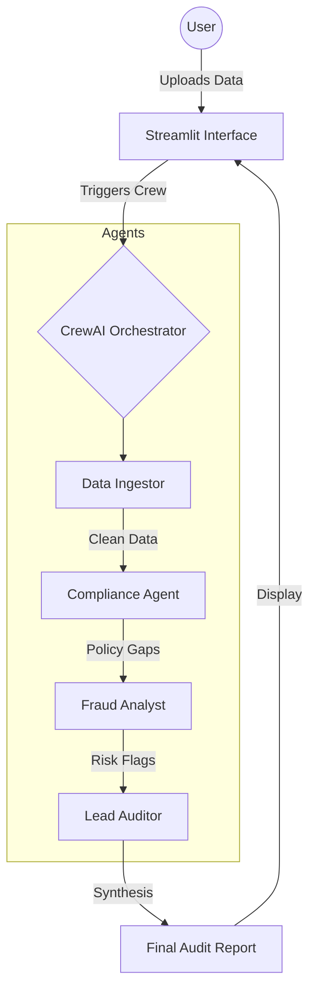

# 🧾 AMACS - Automated Multi-Agent Audit System

[](https://www.python.org)
[](https://crewai.com)
[](https://streamlit.io)
[](https://opensource.org/licenses/MIT)

**AMACS** is an intelligent, multi-agent ecosystem built on **CrewAI** that automates the end-to-end financial auditing process. By orchestrating a team of specialized AI agents, AMACS transforms raw financial data into comprehensive, risk-assessed audit reports with human-level reasoning.

---

## 🧠 System Architecture

AMACS utilizes a sequential and hierarchical task execution model where agents hand off verified data to one another.


## 🚀 Overview

AMACS is a multi-agent AI system built using CrewAI that automates financial auditing workflows including:

* Data ingestion (ETL)
* Compliance validation
* Fraud detection
* Risk-based audit reporting

## 🧠 Architecture

User → Streamlit UI → CrewAI Agents
→ Data Ingestor → Compliance Agent → Fraud Analyst → Lead Auditor
→ Final Audit Report

## ⚙️ Tech Stack

* Python
* CrewAI (multi-agent orchestration)
* OpenRouter (LLM backend)
* Streamlit (UI)
* Pandas + DuckDB (ETL)
* ChromaDB (memory - upcoming)

## 📊 Features

* Multi-agent collaboration
* Explainable fraud detection
* Compliance rule engine
* Automated audit report generation
* Risk scoring system

## ▶️ Run Locally

```bash
git clone https://github.com/19Vermouth/amacs-audit-system.git
cd amacs-audit-system
```
```
python -m venv .venv
.venv\Scripts\activate
```
```
pip install -r requirements.txt
streamlit run app.py
```

## 🔐 Environment Setup

Create `.env` file:

OPENROUTER_API_KEY=your_key_here

## 📸 Sample Output

* Compliance violations
* Fraud alerts with risk score
* Final audit report

## 🚀 Future Scope

* RAG for compliance documents
* Agent memory system
* Advanced fraud ML models
* Dashboard visualizations

## 👨‍💻 Author
Ishaan Kar
